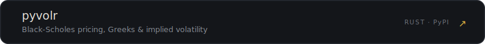
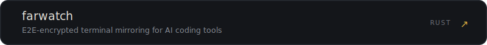
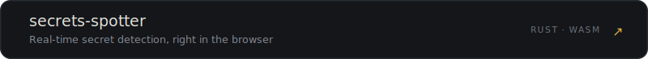
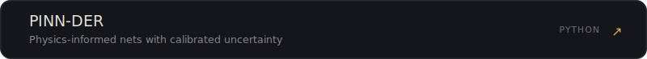
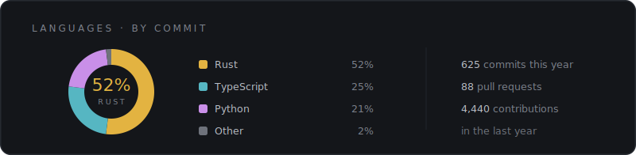

<!--
  Profile README for github.com/yipjunkai.
  Editorial design on a dark, terminal-toned ground. GitHub strips CSS from READMEs,
  so the styled look lives in committed SVGs under assets/. Each project card is its own
  SVG wrapped in a link, so the works are real hyperlinks. Card figures are a snapshot —
  re-run the generator to refresh them.
-->

  

  

  

<b>ELSEWHERE</b>&nbsp;&nbsp; <a href="https://yipjunkai.com">yipjunkai.com</a> &nbsp;&middot;&nbsp; <a href="https://github.com/yipjunkai">GitHub</a> &nbsp;&middot;&nbsp; <a href="https://www.linkedin.com/in/yipjk/">LinkedIn</a> &nbsp;&middot;&nbsp; <a href="mailto:hello@yipjunkai.com">hello@yipjunkai.com</a>

