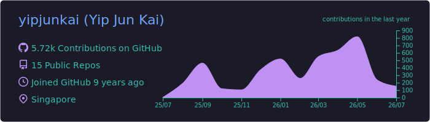
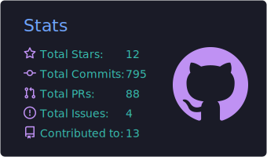
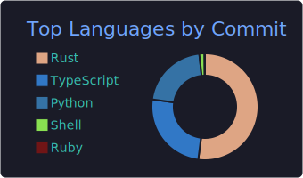
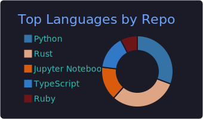
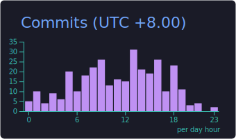

<!--
  GitHub profile README for github.com/yipjunkai
  This repo must be named exactly "yipjunkai" for GitHub to render it on your profile.
  Lines marked  <!-- TODO -->  are assumptions/placeholders — tweak or delete them.
-->

# Hi, I'm Yip Jun Kai 👋

**Software developer — Rust systems, quant finance & applied ML.**
Shipping fast, correct software across web, mobile & desktop, from San Francisco 🌉 & Singapore 🇸🇬.

---

### 🧭 What I build

- 🦀 **Systems in Rust** — pricing engines, end-to-end encrypted developer tooling, and browser/WASM security
- 📈 **Quant finance** — options pricing, Greeks & implied volatility ([`pyvolr`](https://github.com/yipjunkai/pyvolr))
- 🔐 **Applied cryptography & security** — E2E-encrypted transport, real-time secret detection
- 🧠 **ML research** — physics-informed & uncertainty-aware neural networks
- 🌐 **Full-stack** across Web, Mobile & Desktop — TypeScript/React on the front, Rust/Python underneath

<!-- TODO: currently at Kipo AI (https://github.com/kipo-ai) — add a line on what you're building there -->

---

### 🧰 Tech stack

**Languages**

**Systems & performance**

**ML & data**

**Web & mobile** <!-- TODO: trim anything you don't want to claim -->

---

### 🚀 Featured projects

| Project | What it is | Stack |
| --- | --- | --- |
| [**pyvolr**](https://github.com/yipjunkai/pyvolr) | Modern Black-Scholes-Merton pricing, Greeks & implied volatility for Python — Rust core, vectorized, a drop-in replacement for the abandoned `py_vollib`. Published on PyPI. | `Rust` · `Python` · `PyO3` |
| [**farwatch**](https://github.com/yipjunkai/farwatch) | Securely access your AI coding assistant from any device via end-to-end encrypted terminal mirroring — zero-knowledge relay + Flutter app. | `Rust` · `Flutter` · `AES-GCM` |
| [**secrets-spotter**](https://github.com/yipjunkai/secrets-spotter) | Chrome extension that detects exposed secrets (API keys, tokens, passwords) on pages and in network traffic in real time. | `Rust` · `WASM` |
| [**PINN-DER**](https://github.com/yipjunkai/PINN-DER) | Physics-Informed Neural Networks + Deep Evidential Regression for calibrated uncertainty estimates. | `Python` · `PyTorch` |

---

### 📊 GitHub in numbers

<!--
  These cards are static SVGs generated by the GitHub Action in
  .github/workflows/profile-summary-cards.yml and committed to the repo,
  so they never break from a rate-limited live service.
  They appear after the Action's first successful run (see setup steps).
-->

---

  Let's build something fast and correct — <a href="mailto:hello@yipjunkai.com">hello@yipjunkai.com</a>

