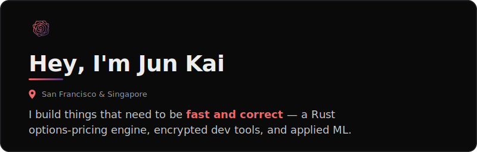
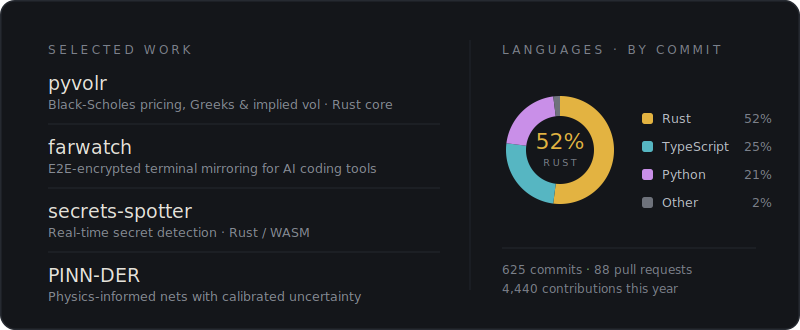

<!--
  Profile README for github.com/yipjunkai.
  Editorial design on a dark, terminal-toned ground. GitHub strips CSS from READMEs,
  so the styled look lives in committed SVGs under assets/. The language donut is
  by commit; assets/work-languages.svg is regenerated by a scheduled GitHub Action.
-->

